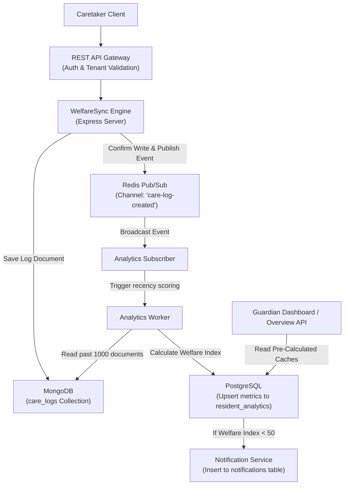

# WelfareSync Engine

> **Scalable Multi-Tenant Resident Welfare Analytics & Monitoring System**

---

### Project Status & Badges

[](file:///K:/Kuralara_CareConnect/WelfareSync)
[](file:///K:/Kuralara_CareConnect/WelfareSync)
[](https://nodejs.org/)
[](https://expressjs.com/)
[](https://www.postgresql.org/)
[](https://www.mongodb.com/)
[](https://redis.io/)
[](file:///K:/Kuralara_CareConnect/WelfareSync/LICENSE)

---

## Academic Metadata

| Property | Details |
| :--- | :--- |
| **Author** | **Kurinji Eswar J A** |
| **Degree** | Bachelor of Technology (B.Tech)<br>Computer Science and Engineering |
| **Academic Year** | 2026–2027 |
| **Project Supervisor** | **Dr. Ajey Prasaath K.B** |
| **Designation** | Assistant Professor |
| **Institution** | SRM Institute of Science and Technology,<br>Tiruchirappalli Campus |

---

## Project Description

The **WelfareSync Engine** is a backend service designed to automate resident welfare monitoring in elderly homes, care homes, shelters, and rehabilitation centers. It processes health telemetry logs asynchronously, updates resident well-being scores, registers automated alert warnings, and aggregates metrics across multiple isolated care organizations using a single system instance.

---

## Project Timeline

| Date | Phase | Activities |
| :--- | :--- | :--- |
| **01 June 2026** | NGO Visit & Problem Identification | Visited the NGO, observed existing resident care workflows, interacted with staff, identified challenges in manual monitoring, fragmented records, delayed analytics, and lack of centralized welfare tracking. |
| **03 June 2026** | Proposed Solution | Proposed WelfareSync Engine featuring Hybrid Database Architecture, Multi-Tenant Backend, Event-Driven Analytics, and REST APIs. |
| **04–06 June 2026** | Requirements Analysis | Gathered functional requirements, identified user roles, finalized scope, system objectives, and technology stack. |
| **07–09 June 2026** | Architecture & Database Design | Designed the Hybrid Database Architecture, REST API structure, Multi-Tenant Architecture, Redis Event Pipeline, and Analytics Engine. |
| **10–15 June 2026** | System Implementation | Developed authentication, institution management, resident management, care logging, analytics processing, notifications, and dashboard APIs using Node.js, Express.js, PostgreSQL, MongoDB, and Redis. |
| **16–18 June 2026** | Testing & Validation | Performed API testing, analytics verification, deployment testing, tenant isolation testing, and database validation. |
| **19 June 2026** | Project Demonstration | Demonstrated the completed WelfareSync Engine to the NGO, explained the architecture, workflows, and validated system functionality. |
| **20 June 2026** | NGO Project Completion | Successfully completed the project, submitted deliverables, and received the Project Completion Certificate. All NGO-related activities concluded on this date. |
| **21–24 June 2026** | Academic Documentation | Prepared SRS, HLD, LLD, Database Design, API Documentation, and Deployment Guide for academic submission. |
| **25–27 June 2026** | Documentation Enhancement | Completed Testing Report, Architecture Report, Final Project Report, Viva Preparation Guide, Project Structure documentation, and Postman documentation. |
| **28–29 June 2026** | Repository Finalization | Refined GitHub repository, improved Mermaid diagrams, standardized documentation, updated README, and completed repository quality review. |
| **30 June 2026** | Post-Deployment Maintenance | Addressed minor implementation refinements, documentation corrections, repository maintenance, and post-deployment observations independently without requiring further NGO visits. |

### Timeline Note

The official NGO engagement concluded on **20 June 2026** with successful project completion and issuance of the completion certificate.

All work completed after **20 June 2026** consisted solely of academic documentation, GitHub repository refinement, project reporting, post-deployment maintenance, and viva preparation. No additional NGO visits or operational development activities were performed after the certificate was issued.

---

## Problem Statement

In care facilities, tracking resident health indicators involves processing large amounts of diverse data (e.g., blood pressure, diet volumes, medication adherence). Traditional architectures encounter performance bottlenecks:

*   **Manual Records**: Error-prone and lack real-time risk identification.
*   **SQL Schema Migrations**: Rigid relational structures make modifications to dynamic telemetry formats complex.
*   **Read/Write Resource Bottlenecks**: Running calculations over millions of raw log entries blocks database reads and slows API response times.
*   **Data Isolation Risks**: Multi-tenant systems must enforce logical boundaries to prevent organizations from accessing each other's resident records.

---

## Key Features

*   **Multi-Tenant Architecture**: Shared-database, schema-isolated configuration logic isolates tenant data using logical validation checks.
*   **Tenant Isolation Middleware**: Validates incoming request headers (`X-Tenant-ID`) against signed token credentials.
*   **Dynamic Care Logging**: Schema-flexible timelines in MongoDB ingest dynamic medication, nutrition, activity, and vitals records.
*   **Redis Event Pipeline**: Decouples computations using Redis Pub/Sub, keeping API write response times low.
*   **Analytics Recalculator**: Implements time-decay algorithms and resident-specific weight configurations.
*   **Notification Engine**: Automatically logs warnings in PostgreSQL when resident welfare indexes drop below 50.
*   **Aggregated Overview Dashboard**: Compiles facility metrics from pre-calculated SQL tables to ensure low latency.

---

## System Architecture

The engine uses a decoupled event-driven data flow to route client inputs to databases:



---

## Hybrid Database Architecture

WelfareSync implements a hybrid database layout to manage the dual demands of transactional safety and telemetry ingestion:

### 1. PostgreSQL (ACID Metadata)
*   **Used For**: Organizational tenants, user credentials, refresh tokens, active institutions, resident demographic profiles, pre-calculated score indices, and alert logs.
*   **Selected Because**: Provides reliable ACID compliance, referential integrity, and cascading deletions to keep child records clean when parent records are removed.

### 2. MongoDB (Timeline Data Store)
*   **Used For**: Daily caretaker logs and health telemetry events.
*   **Selected Because**: Provides schema flexibility (accommodating medication, nutrition, vitals, and activity records in a single collection) and document-oriented write speed.

### 3. Redis (In-Memory Broker)
*   **Used For**: Routing event notifications via the `care-log-created` channel.
*   **Selected Because**: Provides low-latency, in-memory Pub/Sub messaging to decouple computational calculations from the main HTTP API thread.

---

## Redis Event Pipeline

The event pipeline processes health records asynchronously:

1.  **POST /logs**: Caretakers post a health record to the API.
2.  **MongoDB Write**: The Express controller saves the care log document to MongoDB.
3.  **Redis Publish**: The controller publishes the log metadata to the `care-log-created` channel and returns a success response.
4.  **Analytics Worker**: The subscriber receives the message and triggers the background worker.
5.  **Score Recalculation**: The worker fetches up to 1000 historical logs for the resident, recalculates category scores, and updates the `resident_analytics` PostgreSQL table.
6.  **Alert Trigger**: If the computed Welfare Index is $< 50$, the worker inserts a warning into the PostgreSQL `notifications` table.

---

## Technology Stack

*   **Backend Framework**: Node.js, Express.js
*   **Databases**: PostgreSQL (SQL-native), MongoDB (NoSQL document store)
*   **Message Broker**: Redis Pub/Sub
*   **Database Drivers**: `pg` (node-postgres), `Mongoose`
*   **Authentication & Security**: JWT with token version tracking, bcrypt hashing, Helmet hardening, CORS, and NoSQL/SQL parameterized input validation.

---

## Installation & Setup

### 1. Install Dependencies

```bash
npm install
```

### 2. Configure Environment Variables

Create a `.env` file in the root directory:

```ini
# App Server configurations
PORT=5000
NODE_ENV=development

# PostgreSQL Connection Credentials
POSTGRES_HOST=127.0.0.1
POSTGRES_PORT=5432
POSTGRES_DB=welfaresync_db
POSTGRES_USER=postgres
POSTGRES_PASSWORD=<your_database_password>
PGPOOL_MAX=10

# MongoDB Connection String
MONGODB_URI=mongodb://127.0.0.1:27017/welfaresync_mongo

# Redis Connection Setup
REDIS_HOST=127.0.0.1
REDIS_PORT=6379

# Authorization Credentials
JWT_SECRET=super_secret_jwt_signature_hash_phrase
JWT_ACCESS_EXPIRATION=15m
JWT_REFRESH_EXPIRATION=7d
CORS_ALLOWED_ORIGINS=http://localhost:3000,http://127.0.0.1:3000
```

### 3. Running the Project

#### Database Services Setup

*   Ensure PostgreSQL and MongoDB services are running locally on their default ports.
*   Run the Redis container:

```bash
docker run -d --name redis-welfaresync -p 6379:6379 redis:alpine
```

#### Start Server

```bash
npm run dev
```

---

## Repository Structure

The project directory is structured as follows:

*   [src/config/](file:///K:/Kuralara_CareConnect/WelfareSync/src/config/): Configuration layer establishing native PostgreSQL client pools, MongoDB Mongoose clients, and Redis broker connections.
*   [src/middleware/](file:///K:/Kuralara_CareConnect/WelfareSync/src/middleware/): Express middleware pipelines handling JWT decoding (`authenticate`), logical multi-tenancy verification (`tenantValidation`), and privilege checks (`authorize`).
*   [src/modules/](file:///K:/Kuralara_CareConnect/WelfareSync/src/modules/): Modular business logic folders split by domains (e.g. `auth`, `residents`, `logs`, `dashboard`). Each module encapsulates its respective Express router, controllers handlers, service logic, and repositories.
*   [src/routes/](file:///K:/Kuralara_CareConnect/WelfareSync/src/routes/): Main router mapping prefix paths and hosting the `/health` API.
*   [src/workers/](file:///K:/Kuralara_CareConnect/WelfareSync/src/workers/): Background computational workers recalculating scores.
*   [src/events/](file:///K:/Kuralara_CareConnect/WelfareSync/src/events/): Event Pub/Sub logic containing Redis publishers and subscribers.
*   [docs/](file:///K:/Kuralara_CareConnect/WelfareSync/docs/): Verification suite and comprehensive technical specifications documentation.
*   [README.md](file:///K:/Kuralara_CareConnect/WelfareSync/README.md): Root project guide.
*   [LICENSE](file:///K:/Kuralara_CareConnect/WelfareSync/LICENSE): MIT project license.
*   [.env](file:///K:/Kuralara_CareConnect/WelfareSync/.env): Local environment properties configuration keys template.

---

## Documentation Index

All technical files are stored in the `/docs` directory:

1.  **[SRS.md](file:///K:/Kuralara_CareConnect/WelfareSync/docs/SRS.md)**: Software Requirements Specification.
2.  **[HLD.md](file:///K:/Kuralara_CareConnect/WelfareSync/docs/HLD.md)**: High-Level Design.
3.  **[LLD.md](file:///K:/Kuralara_CareConnect/WelfareSync/docs/LLD.md)**: Low-Level Design.
4.  **[DATABASE_DESIGN.md](file:///K:/Kuralara_CareConnect/WelfareSync/docs/DATABASE_DESIGN.md)**: Database Schemas and Index Designs.
5.  **[API_DOCUMENTATION.md](file:///K:/Kuralara_CareConnect/WelfareSync/docs/API_DOCUMENTATION.md)**: REST Endpoints JSON Payloads.
6.  **[DEPLOYMENT_GUIDE.md](file:///K:/Kuralara_CareConnect/WelfareSync/docs/DEPLOYMENT_GUIDE.md)**: Local Startup Guide.
7.  **[TESTING_REPORT.md](file:///K:/Kuralara_CareConnect/WelfareSync/docs/TESTING_REPORT.md)**: Manual Test Cases and Traces.
8.  **[ARCHITECTURE_REPORT.md](file:///K:/Kuralara_CareConnect/WelfareSync/docs/ARCHITECTURE_REPORT.md)**: Architecture Decision Records (ADRs).
9.  **[FINAL_PROJECT_REPORT.md](file:///K:/Kuralara_CareConnect/WelfareSync/docs/FINAL_PROJECT_REPORT.md)**: Full Academic Thesis Report.
10. **[VIVA_PREPARATION.md](file:///K:/Kuralara_CareConnect/WelfareSync/docs/VIVA_PREPARATION.md)**: Examiner Questions and Answers.
11. **[POSTMAN_COLLECTION.md](file:///K:/Kuralara_CareConnect/WelfareSync/docs/POSTMAN_COLLECTION.md)**: Postman collection configurations.
12. **[PROJECT_STRUCTURE.md](file:///K:/Kuralara_CareConnect/WelfareSync/docs/PROJECT_STRUCTURE.md)**: Project folder architecture.

---

## System Boundaries

### Current Academic Scope

*   **Single-Node Operations**: Express applications and background workers run as local Node.js processes.
*   **Local Databases**: Relational and document databases run on standalone local instances.
*   **In-Memory Event Brokers**: Redis Pub/Sub does not persist messages.
*   **Manual Validation**: Test cases are executed using manual testing configurations and Postman collections.

### Future Production Enhancements

*   **Container Orchestration**: Deploying system components using Docker Compose and Kubernetes.
*   **Message Broker Upgrades**: Transitioning Redis Pub/Sub to Redis Streams or Apache Kafka to provide persistent event logging.
*   **Real-Time Alerts**: Integrating WebSockets to push warning alerts to client dashboards in real-time.
*   **External Integrations**: Connecting external notification services (such as Twilio and SendGrid) to send SMS and email alerts directly to guardians.
*   **Observability**: Adding Prometheus monitoring and Grafana metrics dashboards.

---

## Revision History

| Version | Date | Description |
| :--- | :--- | :--- |
| **v0.1** | 03 June 2026 | Initial project proposal prepared. |
| **v0.2** | 06 June 2026 | Requirements finalized. |
| **v0.3** | 09 June 2026 | System architecture completed. |
| **v0.4** | 15 June 2026 | Core backend implementation completed. |
| **v0.5** | 18 June 2026 | Testing and validation completed. |
| **v1.0** | 20 June 2026 | NGO project completed and completion certificate received. |
| **v1.1** | 24 June 2026 | Academic documentation prepared. |
| **v1.2** | 27 June 2026 | Architecture, deployment, testing, and API documentation finalized. |
| **v1.3** | 29 June 2026 | GitHub repository standardized and documentation reviewed. |
| **v1.4** | 30 June 2026 | Final repository maintenance and academic submission readiness completed. |

---

## License

This project is licensed under the MIT License - see the [LICENSE](file:///K:/Kuralara_CareConnect/WelfareSync/LICENSE) file for details.