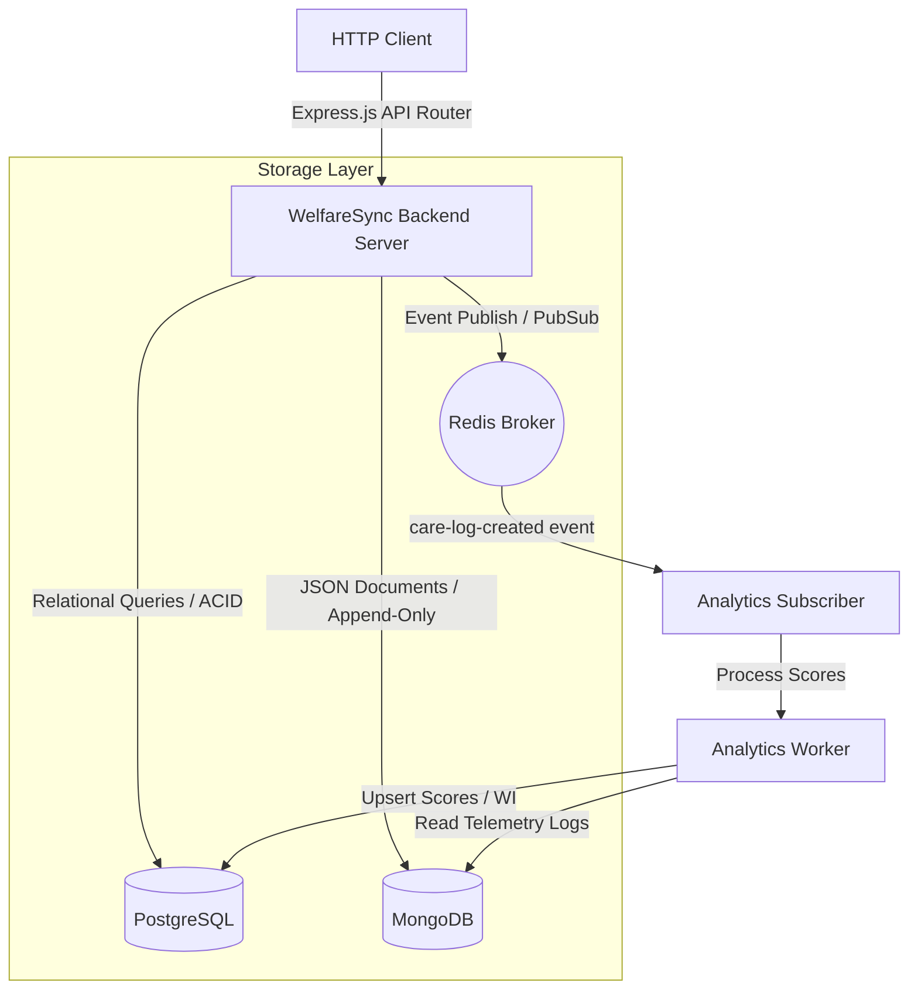
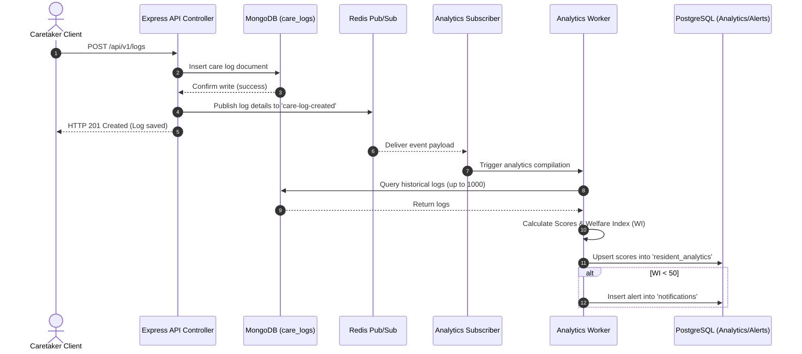
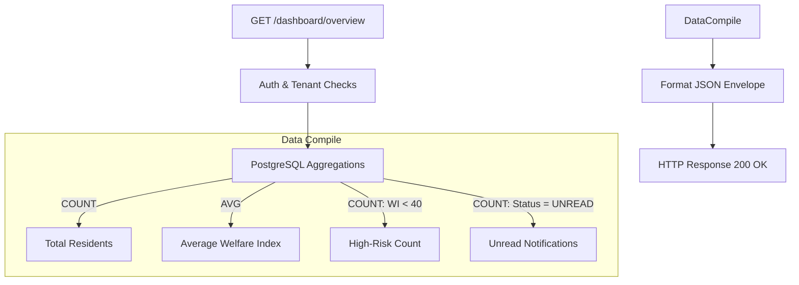
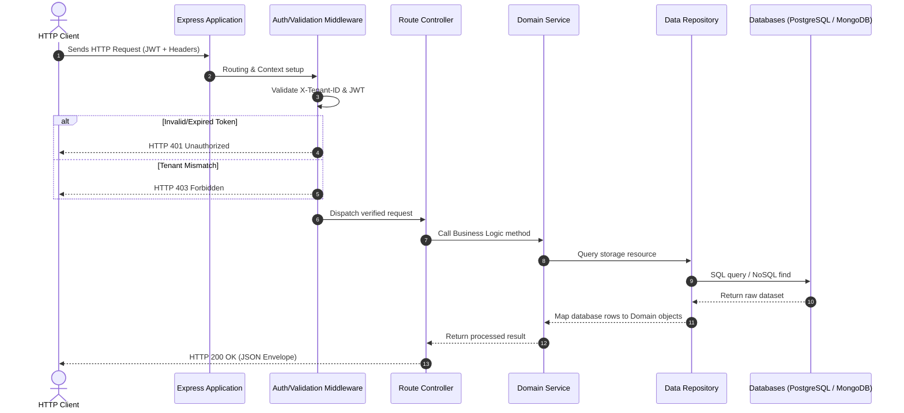
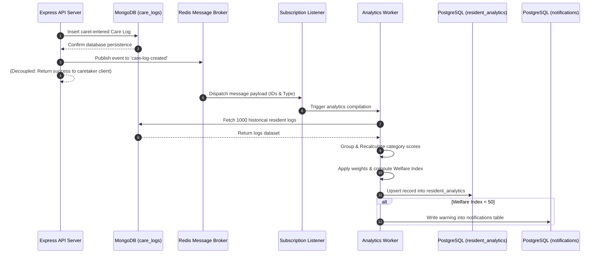

# Architecture Report: WelfareSync Engine
## Scalable Multi-Tenant Resident Welfare Analytics & Monitoring System

---

## 1. Introduction

### 1.1 Document Purpose
This Architecture Report provides a comprehensive technical overview and architectural justification for the **WelfareSync Engine**. It details system design decisions, data flow configurations, database strategies, security mechanisms, and scalability pathways. The report serves as a core reference for technical evaluation, academic defense, and future production scaling.

### 1.2 System Scope
The WelfareSync Engine is a backend service developed using Node.js and Express.js. It facilitates multi-tenant resident management, dynamic care logging, and asynchronous health telemetry compilation. It uses a **Hybrid Database Architecture** consisting of PostgreSQL for metadata registry, MongoDB for high-write telemetry logging, and Redis for Pub/Sub messaging and event processing.

---

## 2. Hybrid Database Architecture

The WelfareSync Engine implements a hybrid database layout to handle the dual demands of transactional administrative safety and high-throughput, unstructured telemetry ingestion.



### 2.1 Why PostgreSQL was Selected
PostgreSQL serves as the relational foundation of the system. It is utilized to manage structured models requiring transactional safety, strong relational constraints, and complex administrative queries.
*   **Relational Integrity**: Enforces strict foreign key relations between tenants, institutions, users, and residents.
*   **ACID Compliance**: Crucial for operations such as multi-tenant onboarding, user registrations, and notification logs, where database operations must execute atomically.
*   **Index Optimization**: Multi-column index setups enable rapid lookups by `tenant_id` and relational keys.

### 2.2 Why MongoDB was Selected
MongoDB acts as the chronological telemetry archive. It is used to store high-write resident care logs.
*   **Schema Flexibility**: Care logs encompass varied structures (e.g., medication requires dose and frequency; vitals require blood pressure, pulse, and temperature). Storing these in a document store avoids rigid relational schema migrations.
*   **Append-Only Write Speed**: MongoDB's memory-mapped database structure is designed to ingest high-frequency timeline entries quickly.
*   **Nested Document Indexing**: Enables indexing on fields like `details.score` or `recordedAt` within unstructured JSON.

### 2.3 Why Redis was Selected
Redis serves as the system's in-memory messaging broker, decoupling web API request-response loops from computational calculations.
*   **Microsecond Latency**: Operates completely in-memory, routing event payloads instantly.
*   **Process Decoupling**: Allows the Express.js application thread to immediately return a success response to the caretaker while the background worker processes the analytics.

### 2.4 Benefits of the Hybrid Database Architecture
*   **Workload Isolation**: CPU-heavy calculation tasks do not impact the transactional database layer. Write-heavy logs target MongoDB, while metadata queries run on PostgreSQL.
*   **Optimal Data-to-Storage Mapping**: Relational administrative profiles leverage SQL, while flexible time-series care records leverage MongoDB's document architecture.
*   **Performance Scaling**: Dashboards fetch pre-calculated telemetry indices from PostgreSQL tables in under 50ms, avoiding expensive real-time database scans over raw telemetry logs.

---

## 3. Architecture Decision Records (ADR)

The following records document key structural decisions made during the design of the WelfareSync Engine.

### ADR-01: Relational Schema Metadata Registry (PostgreSQL)
*   **Decision**: Deploy PostgreSQL as the primary transactional storage engine for institutional records, user profiles, resident registries, and computed analytics indices.
*   **Context**: The application manages multi-tenant metadata that demands strict schema enforcement, data consistency, and relational integrity.
*   **Alternatives Considered**: MySQL, SQLite. SQLite was rejected due to lack of multi-tenant scale capability, and PostgreSQL was selected over MySQL for its robust SQL standard compliance, superior JSON handling (for future growth), and indexing support.
*   **Justification**: PostgreSQL provides reliable ACID-compliant transactions and advanced query optimization, which are necessary to prevent tenant data leakage and configuration errors.
*   **Impact**: Simplifies security checks and ensures data cleanliness via foreign key cascades. All metadata operations are strictly defined and validated.

### ADR-02: Document Store for Dynamic Care Log Telemetry (MongoDB)
*   **Decision**: Use MongoDB to store and query the stream of unstructured daily care logs and resident vitals.
*   **Context**: Care logs are populated by caretakers with varying telemetry formats depending on the log type (`medication`, `nutrition`, `vitals`, `activity`).
*   **Alternatives Considered**: JSONB columns in PostgreSQL, Apache Cassandra. Cassandra was rejected due to operational complexity. PostgreSQL JSONB columns were rejected to isolate write-intensive logging operations from administrative SQL transactions.
*   **Justification**: MongoDB's document-centric architecture naturally maps to polymorphic care logs and scales horizontally.
*   **Impact**: Eliminates schema migrations for telemetry changes. Care log ingestion handles high-write volumes without blocking core metadata read/write queries.

### ADR-03: In-Memory Message Broker for Decoupled Score Calculations (Redis Pub/Sub)
*   **Decision**: Use Redis Pub/Sub to broker events from care log submissions to the analytics background workers.
*   **Context**: Re-computing resident welfare scores on every log write is a computationally heavy process that, if run synchronously, degrades HTTP API performance.
*   **Alternatives Considered**: Kafka, RabbitMQ, in-memory Node.js `EventEmitter`. An in-memory emitter was rejected because it cannot scale across process boundaries. Kafka/RabbitMQ were rejected as they introduce excessive complexity for a single-node deployment.
*   **Justification**: Redis Pub/Sub provides low-latency messaging, uses minimal memory, and allows horizontal scaling of workers.
*   **Impact**: Lowers API write response latencies under 50ms. Background processes execute independently.

### ADR-04: Logical Data Segregation for Multi-Tenancy (Shared-Database, Shared-Schema)
*   **Decision**: Implement logical multi-tenancy using a shared-database, shared-schema strategy, segregating tenants using a mandatory `tenantId`/`tenant_id` column.
*   **Context**: The system must isolate data between multiple independent care institutions while maintaining low resource costs and ease of management.
*   **Alternatives Considered**: Database-per-tenant, Schema-per-tenant. Database-per-tenant was rejected due to high resource overhead. Schema-per-tenant was rejected because of schema migration complexity across hundreds of schemas.
*   **Justification**: Shared-database logical isolation is highly cost-effective and integrates with backend authorization structures.
*   **Impact**: Requires strict developer discipline and query validation. Every database fetch query must include a `tenantId`/`tenant_id` clause.

---

## 4. PostgreSQL Architecture

PostgreSQL handles core identity, configuration, and index summaries.

### 4.1 Schema Normalization & Key Tables
Relational integrity is enforced by structured SQL tables initialized on startup within the module repository layers:
*   `tenants`: Defines isolated tenant organizational units (each with a unique slug).
*   `users`: Stores usernames, bcrypt-hashed passwords, role claims, and `token_version` to handle session invalidation.
*   `residents`: Maps resident demographic data, status, and custom category weights.
*   `resident_analytics`: Pre-calculated cache containing current category scores and the overall Welfare Index.
*   `notifications`: Warning log table containing system alert records triggered by the worker.

### 4.2 Relational Integrity & Cascade Rules
To prevent data fragmentation, foreign keys are defined with `ON DELETE CASCADE` constraints:
```sql
ALTER TABLE residents ADD CONSTRAINT fk_tenant FOREIGN KEY (tenant_id) REFERENCES tenants(id) ON DELETE CASCADE;
ALTER TABLE resident_analytics ADD CONSTRAINT fk_resident FOREIGN KEY (resident_id) REFERENCES residents(id) ON DELETE CASCADE;
```
If an institution or tenant is deleted, all user accounts, resident profiles, analytics cache records, and notification logs are removed automatically.

### 4.3 Onboarding Transactions
Tenant registration requires atomic safety. The application uses raw SQL transactions (`BEGIN` and `COMMIT` via a dedicated client connection) to wrap tenant creation and administrative user initialization. If the administrator user insert fails, the transaction is rolled back (`ROLLBACK`), preventing orphaned tenant workspaces.

---

## 5. MongoDB Architecture

MongoDB stores care telemetry within the `care_logs` collection, designed via Mongoose.

### 5.1 Data Structure
Each document contains structured metadata fields alongside a flexible `details` object:
```json
{
  "_id": "ObjectId",
  "tenantId": "c4d79c6d-5db3-4df4-a8c4-c2c61ee36184",
  "residentId": "a92e21b8-68e1-4541-b0e6-ee328b9d6287",
  "caretakerId": "b1827e8d-8a8d-4be9-81a1-f3b145a9018e",
  "type": "vitals",
  "details": {
    "systolic": 120,
    "diastolic": 80,
    "pulse": 72,
    "score": 90.00
  },
  "recordedAt": "2026-05-31T09:00:00.000Z",
  "createdAt": "2026-05-31T09:00:05.000Z"
}
```

### 5.2 Core Indexing Strategy
To optimize time-series queries, compound indices are defined on the Mongoose model:
1.  `{ tenantId: 1, residentId: 1, recordedAt: -1 }`: Optimizes chronological timeline scans for a specific resident.
2.  `{ tenantId: 1, type: 1, recordedAt: -1 }`: Speeds up calculations filtered by log categories.

---

## 6. Redis Event Pipeline

The Redis event pipeline processes health records asynchronously:



### 6.1 Event Lifecycle
1.  **Publishing**: The Express controller saves the care log and immediately dispatches a JSON event to the Redis channel `care-log-created`.
2.  **Payload Design**: The payload is optimized to contain only entity references, reducing memory overhead:
    ```json
    {
      "tenantId": "c4d79c6d-5db3-4df4-a8c4-c2c61ee36184",
      "residentId": "a92e21b8-68e1-4541-b0e6-ee328b9d6287",
      "logId": "6516df4b2f4a1b001258d4b9",
      "type": "vitals"
    }
    ```
3.  **Consumption**: The subscription listener intercepts the payload, extracts the resident key, and passes it to the `analyticsWorker` context.

---

## 7. Multi-Tenant Architecture

WelfareSync implements a shared-database, logical isolation strategy.

```mermaid
graph TD
    Request[HTTP Request] --> AuthMiddleware{Auth Middleware}
    
    AuthMiddleware -->|Missing X-Tenant-ID or Mismatch| Err[HTTP 403 Forbidden]
    AuthMiddleware -->|Validated Tenant Context| Repo[Repository Layer]
    
    subgraph Isolated Queries
        Repo -->|Append: WHERE tenant_id = contextId| PG[(PostgreSQL)]
        Repo -->|Append: { tenantId: contextId }| Mongo[(MongoDB)]
    end
```

### 7.1 Isolation Validation
1.  **Header Verification**: Every API request targeting tenant data must pass the `X-Tenant-ID` header.
2.  **Context Match**: The authentication middleware extracts the user's tenant ID from the signed JWT payload. The tenant validation middleware then verifies that the header `X-Tenant-ID` matches the `tenantId` in the authenticated context (`req.auth`):
    ```javascript
    const tenantId = req.headers['x-tenant-id'];
    if (tenantId !== req.auth.tenantId) {
      throw new AppError('Tenant access denied', 403);
    }
    ```
3.  **Query-Level Filtering**: Every repository layer function enforces tenant isolation by appending explicit tenant qualifiers to all queries:
    -   *PostgreSQL*: `WHERE tenant_id = tenantId`
    -   *MongoDB*: `{ tenantId: tenantId }`

---

## 8. Analytics Engine Architecture

The analytics engine processes historical care log records to compute health metrics.

### 8.1 Background Worker Core Scoring Algorithm
When triggered, the worker fetches up to 1000 logs from MongoDB for the specified resident. Logs are grouped into four categories: `medication`, `nutrition`, `vitals`, and `activity`.
*   **Explicit Score Averaging**: If logs in a category contain explicit numerical scores (`details.score`), the sub-score is the average of these values.
*   **Recency-Based Scoring**: If no explicit scores are present, the category score is derived from the recency of the logs:
    -   $\le 1 \text{ day old} \implies 100$
    -   $\le 3 \text{ days old} \implies 85$
    -   $\le 7 \text{ days old} \implies 70$
    -   $\le 14 \text{ days old} \implies 50$
    -   $> 14 \text{ days old} \implies 25$
    -   *No logs* $\implies 0$

### 8.2 Welfare Index Computation Formula & Clamping
The Welfare Index ($WI$) is a weighted average of the computed scores for medication, nutrition, and vitals, using weights configured on the resident's profile.
$$WI = \text{clampScore}\left(\frac{(W_{\text{med}} \times S_{\text{med}}) + (W_{\text{nut}} \times S_{\text{nut}}) + (W_{\text{vit}} \times S_{\text{vit}})}{W_{\text{med}} + W_{\text{nut}} + W_{\text{vit}}}\right)$$

Where:
*   $W_{\text{med}}, W_{\text{nut}}, W_{\text{vit}}$ represent the resident's specific weights for medication, nutrition, and vitals stored in PostgreSQL.
*   $S_{\text{med}}, S_{\text{nut}}, S_{\text{vit}}$ represent the computed category scores.
*   $\text{clampScore}(x) = \max(0, \min(100, \text{toFixed}(x, 2)))$

> [!NOTE]
> Physical activity scores ($S_{\text{act}}$) are calculated by the Analytics Worker but are excluded from the weighted Welfare Index computation. This design choice aligns with the PostgreSQL schema constraint, where weights are only configured for medication, nutrition, and vitals.

---

## 9. Notification Architecture

The Notification module alerts care teams to critical drops in resident welfare indices.
*   **Trigger Condition**: If the computed Welfare Index ($WI$) is $< 50.00$, the Analytics Worker invokes the notification service.
*   **Alert Generation**: The notification service writes a warning alert directly into the PostgreSQL `notifications` table, scoped to the resident's tenant.
*   **State Lifecycle**: Alerts default to `UNREAD`. Authorized caretakers or guardians view alerts and transition their state to `READ` using:
    `PATCH /api/v1/notifications/:id/read`

---

## 10. Dashboard Architecture

The Dashboard module compiles facility-wide health metrics.



### 10.1 Dashboard Data Aggregation Flow
Instead of scanning millions of records across MongoDB, dashboard queries are served by pre-calculated values stored in the PostgreSQL index caches (`resident_analytics` and `notifications` tables).

1.  **Facility Overview**: Retrieves aggregate data filtered by `tenant_id` in a single query:
    *   Total resident count.
    *   Categorized risk counts:
        -   $WI < 40 \implies \text{HIGH Risk}$
        -   $40 \le WI < 70 \implies \text{MEDIUM Risk}$
        -   $WI \ge 70 \implies \text{LOW Risk}$
    *   System-wide average Welfare Index.
    *   Unread notifications count.

---

## 11. Security Architecture

WelfareSync implements defense-in-depth security mechanisms.

### 11.1 Token Versioning & Session Revocation
To revoke active user sessions, the system uses a `tokenVersion` pattern.
1.  User credentials are authenticated, and a JWT is issued containing the user's `tokenVersion`.
2.  On subsequent requests, the validation middleware queries PostgreSQL to verify that the token's version matches the database record (`token_version`).
3.  If a user initiates a logout or an administrator forces session termination, the system increments the user's `token_version` in the database. Active tokens are instantly rejected.

### 11.2 Injection Prevention
*   **SQL Injection**: Enforced by using parameterized query bindings (`$1`, `$2`, etc.) in all raw SQL executions performed by the repositories, ensuring that user inputs are never concatenated directly into query strings.
*   **NoSQL Injection**: Incoming HTTP logs payloads are sanitized. The request body is scanned to block keys containing dot (`.`) or dollar (`$`) characters, preventing MongoDB query parameter manipulation.

### 11.3 Express Hardening & CORS
*   **Helmet.js Integration**: Configured to set secure HTTP response headers, preventing clickjacking, MIME sniffing, and cross-site scripting (XSS).
*   **CORS Configuration**: Restricts access to configured origins using whitelist validations:
    ```javascript
    const corsOptions = {
      origin: process.env.CORS_ALLOWED_ORIGINS ? process.env.CORS_ALLOWED_ORIGINS.split(',') : '*',
      methods: ['GET', 'POST', 'PUT', 'DELETE', 'PATCH', 'OPTIONS'],
      allowedHeaders: ['Content-Type', 'Authorization', 'X-Tenant-ID']
    };
    ```

---

## 12. Scalability Analysis

The WelfareSync Engine is designed to scale alongside institutional growth.

### 12.1 Scaling Strategies
*   **Stateless API Instances**: Express application servers do not store session state locally, allowing horizontal scaling behind load balancers.
*   **Database Sharding**: The MongoDB collection `care_logs` is designed to be sharded horizontally using `tenantId` as the shard key, ensuring write operations scale linearly.
*   **Asynchronous Worker Pool**: Multiple instances of the background worker can run concurrently. They subscribe to Redis to ingest and process calculations without blocking HTTP request threads.
*   **Connection Pool Limits**: Databases are protected against connection exhaustion by limiting pool sizes in application configurations (e.g., configuring the `pg` connection pool max capacity via the `PGPOOL_MAX` environment variable, which defaults to 10 connections).

---

## 13. System Flow Visualizations

The following diagrams illustrate the core operational processes and logical pipelines within the WelfareSync Engine.

### 13.1 Request Flow
The HTTP Request Flow represents the lifecycle of a request from the client through the middleware pipeline, validation stages, and service components to the final database queries.



### 13.2 Event Flow
The Event Flow illustrates the asynchronous decoupled processing pipeline powered by Redis Pub/Sub when a Care Log is recorded.



### 13.3 Tenant Isolation Flow
The Tenant Isolation Flow outlines how the application isolates data across tenants at both the HTTP middleware and database layers.

```mermaid
graph TD
    Client[HTTP Client Request] -->|Includes X-Tenant-ID Header| Gateway[Express Router]
    Gateway --> Auth[JWT Authorization Middleware]
    Auth -->|1. Verify signature & expiration| CheckVersion{Verify Token Version}
    CheckVersion -->|Mismatch| Revoked[401 Unauthorized]
    CheckVersion -->|Match| ScopeCheck{X-Tenant-ID == token.tenantId}
    ScopeCheck -->|No| Blocked[403 Forbidden]
    ScopeCheck -->|Yes| SetContext[Attach tenantId to request context]
    SetContext --> Handler[Controller Handler]
    Handler --> Repo[Repository Layer]
    
    subgraph Data Layer Segregation
        Repo -->|1. SQL: WHERE tenant_id = context.tenantId| PG[(PostgreSQL)]
        Repo -->|2. Mongoose: { tenantId: context.tenantId }| Mongo[(MongoDB)]
    end
```

### 13.4 Dashboard Data Aggregation Flow
The Dashboard Aggregation Flow details how SQL aggregates analytics metric counters using relational database indices to load screens rapidly without querying the MongoDB document timeline.

```mermaid
graph TD
    Request[GET /api/v1/dashboard/overview] --> Middleware[Tenant Validation Middleware]
    Middleware --> Controller[Dashboard Controller]
    Controller --> Service[Dashboard Service]
    Service --> Repo[Dashboard Repository]
    
    subgraph SQL Aggregations
        Repo -->|1. Get Total Count| Count[SELECT COUNT(*) FROM residents WHERE tenant_id]
        Repo -->|2. Compute Average Index| Avg[SELECT AVG(welfare_index) FROM resident_analytics WHERE tenant_id]
        Repo -->|3. Risk Categories| Risk[SELECT welfare_index FROM resident_analytics WHERE tenant_id]
        Repo -->|4. Unread Notifications| Notif[SELECT COUNT(*) FROM notifications WHERE tenant_id AND status = 'UNREAD']
    end
    
    Count --> Compile[Compile Overview JSON Payload]
    Avg --> Compile
    Risk -->|Map to HIGH / MEDIUM / LOW| Compile
    Notif --> Compile
    
    Compile --> Response[Return HTTP 200 Response Payload]
```

---

## 14. System Boundaries

### 14.1 Current Academic Scope
The current implementation of the WelfareSync Engine focuses on a validated single-node setup designed for academic evaluation.
*   **Single-Node Deployments**: Express application and background workers run as local Node.js processes.
*   **Local Databases**: Relational data and document logs run on standalone PostgreSQL and MongoDB instances.
*   **Redis Pub/Sub**: Uses in-memory Pub/Sub for messaging, which does not persist messages.
*   **Manual Evaluation**: Operations are verified using manual tests and Postman collections.

### 14.2 Future Production Enhancements
To scale the engine to a production environment, the following enhancements are planned:
*   **Container Orchestration**: Deploying API instances, background workers, databases, and message brokers within Docker containers managed by Kubernetes.
*   **Message Broker Upgrades**: Transitioning Redis Pub/Sub to Redis Streams or Apache Kafka to provide persistent event logging and consumer group offset management.
*   **Real-Time Alerts**: Integrating WebSockets to push warning alerts to client dashboards in real-time.
*   **External Integrations**: Connecting external notification services (such as Twilio and SendGrid) to send SMS and email alerts directly to guardians.
*   **Observability**: Adding Prometheus monitoring and Grafana metrics dashboards.

