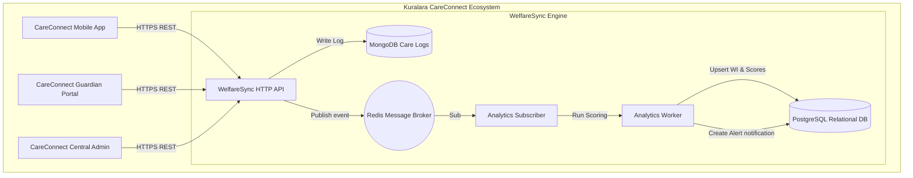
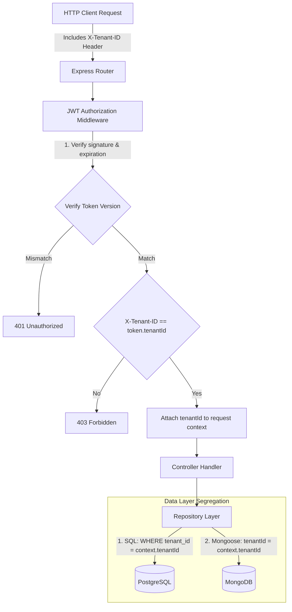
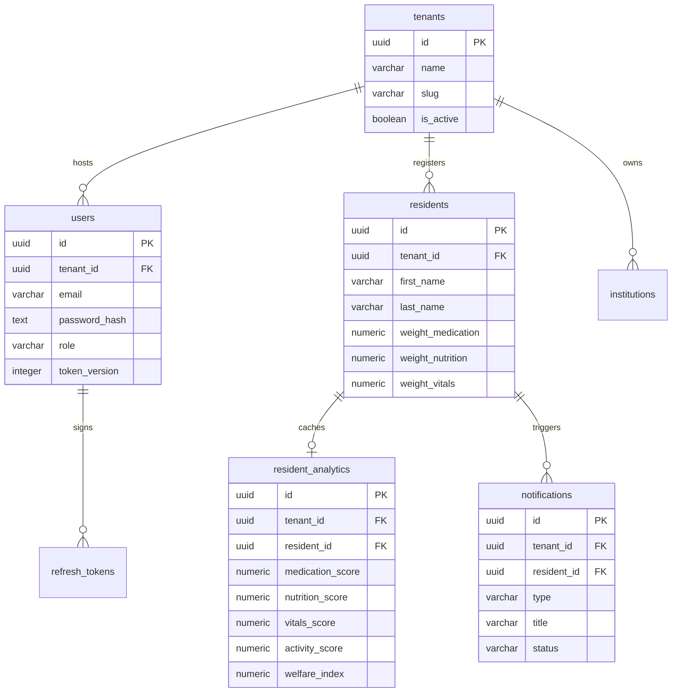
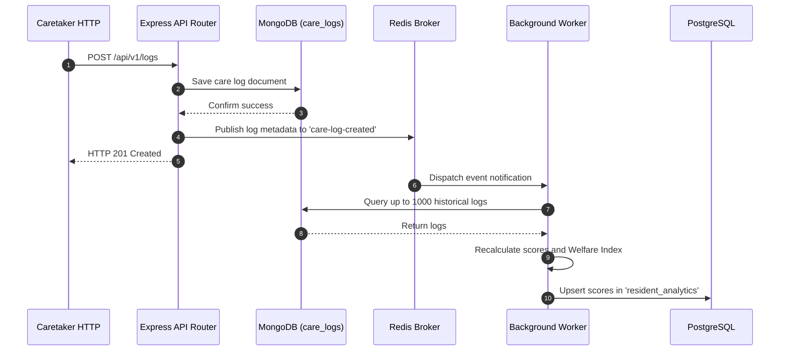
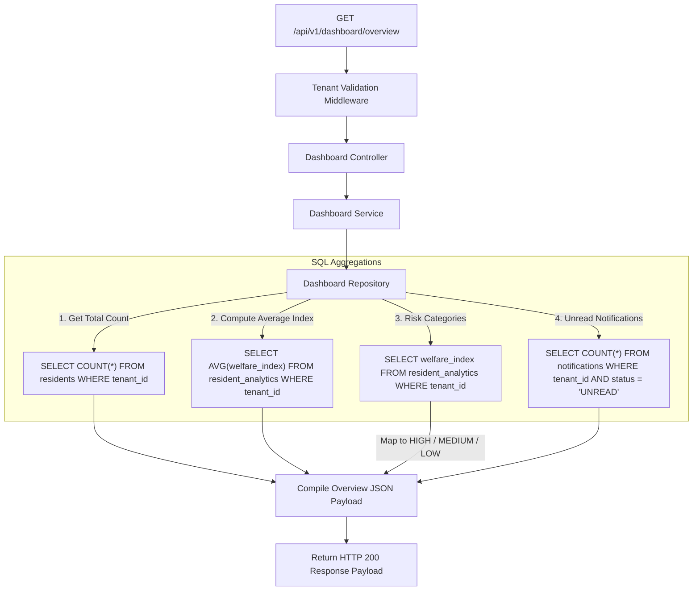

# PROJECT REPORT ON
## WELFARESYNC ENGINE: A SCALABLE MULTI-TENANT RESIDENT WELFARE ANALYTICS & MONITORING SYSTEM

**Submitted in partial fulfillment of the requirements for the award of the degree of**
### Bachelor of Technology (B.Tech) Computer Science and Engineering

**Submitted by:**
*   **Student Name**: Kurinji Eswar J A
*   **Roll Number**: RA2411003050174

**Under the supervision of:**
*   **Project Supervisor**: Dr. Ajey Prasaath K.B
*   **Designation**: Assistant Professor

**Institution:**
*   **SRM Institute of Science and Technology, Tiruchirappalli**

---

## CERTIFICATE

This is to certify that the project report entitled **"WelfareSync Engine: A Scalable Multi-Tenant Resident Welfare Analytics & Monitoring System"** is a bonafide work carried out by **Kurinji Eswar J A** under my supervision and guidance. 

The results embodied in this report have not been submitted to any other University or Institute for the award of any degree or diploma.

**Signature of Supervisor**  
**Date**: May 31, 2026  
**Place**: Tiruchirappalli  

---

## DECLARATION

I hereby declare that the project work entitled **"WelfareSync Engine: A Scalable Multi-Tenant Resident Welfare Analytics & Monitoring System"** submitted to the Department of Computer Science is an original work compiled by me. All sources of information and data utilized in this study have been acknowledged.

**Signature of Student**  
**Date**: May 31, 2026  
**Place**: Tiruchirappalli  

---

## ACKNOWLEDGEMENT

I express my deep gratitude to my supervisor, **Dr. Ajey Prasaath K.B**, designation Assistant Professor, for their invaluable guidance, encouragement, and support throughout the design and implementation of the WelfareSync Engine.

I also extend my sincere thanks to our academic coordinator and head of department for providing the necessary computing resources, lab environments, and administrative support. Finally, I thank my family and peers for their constant support and helpful reviews during the system development process.

---

## ABSTRACT

In modern elderly care, nursing, and institutional resident facilities, tracking resident well-being requires processing heterogeneous health datasets. Conventional approaches rely on manual recording or single-instance databases, which present challenges in scalability, real-time alert dispatch, and multi-tenant data isolation. 

This project presents the **WelfareSync Engine**, a backend architecture designed to address these requirements. WelfareSync uses a **Hybrid Database Architecture** composed of **PostgreSQL** for relational metadata structures, **MongoDB** for high-write telemetry care logs, and **Redis** for Pub/Sub event-driven messaging. 

Logical multi-tenancy is enforced at the HTTP middleware layer and repository queries via tenant scoping, ensuring data isolation across independent care institutions. Care log events trigger asynchronous analytics background processes, where a dedicated Analytics Worker recalculates categories scores (medication, nutrition, vitals) using recency-based scoring algorithms. An overall Welfare Index ($WI$) is computed via resident-specific weight configurations. Warning alerts are generated automatically in PostgreSQL if the computed Welfare Index drops below 50. 

A dashboard compiler provides real-time facility-wide and profile metrics using pre-calculated SQL tables. The system's performance, isolation, and computational correctness have been verified through tests mapping actual server response streams.

---

## TABLE OF CONTENTS
*   **Front Matter**
    *   Title Page
    *   Certificate
    *   Declaration
    *   Acknowledgement
    *   Abstract
    *   Table of Contents
    *   List of Figures
    *   List of Tables
*   **Chapter 1**: Introduction
*   **Chapter 2**: Problem Statement
*   **Chapter 3**: Existing System
*   **Chapter 4**: Proposed System
*   **Chapter 5**: Objectives
*   **Chapter 6**: System Architecture
*   **Chapter 7**: Technology Stack
*   **Chapter 8**: Hybrid Database Architecture
*   **Chapter 9**: Multi-Tenant Design
*   **Chapter 10**: Security Architecture
*   **Chapter 11**: Database Design
*   **Chapter 12**: API Design
*   **Chapter 13**: Analytics Engine
*   **Chapter 14**: Notification System
*   **Chapter 15**: Dashboard Design
*   **Chapter 16**: System Implementation
*   **Chapter 17**: Deployment Architecture
*   **Chapter 18**: Testing and Validation
*   **Chapter 19**: Results and Outcomes
*   **Chapter 19A**: Achievements and Contributions
*   **Chapter 20**: Limitations
*   **Chapter 21**: Future Enhancements
*   **Chapter 22**: Conclusion
*   **Chapter 23**: References
*   **Chapter 24**: Appendices

---

## LIST OF FIGURES
*   *Figure 6.1*: Kuralara CareConnect Ecosystem Architecture Diagram
*   *Figure 6.2*: System Layered Architecture Model
*   *Figure 9.1*: Multi-Tenant Data Isolation Flow Diagram
*   *Figure 11.1*: Relational Schema Relationships Model
*   *Figure 13.1*: Decoupled Redis Pub/Sub Event Ingestion Diagram
*   *Figure 15.1*: Pre-calculated SQL Dashboard Aggregation Pipeline
*   *Figure 16.1*: Express Request HTTP Validation Flow Diagram

---

## LIST OF TABLES
*   *Table 11.1*: PostgreSQL Table Directory
*   *Table 12.1*: Core REST API Endpoint Directory
*   *Table 18.1*: API Verification Execution Output Matrix
*   *Table 19.1*: System Verification Test Case Summaries

---

## CHAPTER 1: INTRODUCTION

The rise in global aging populations has increased the demand for professional care institutions. Managing these facilities requires collecting, archiving, and analyzing resident health indicators, including vitals signs, diet logs, physical activities, and medication regimens. 

WelfareSync is a multi-tenant backend engine that processes health telemetry logs and provides analytics. It isolates data between independent care institutions while using common database instances to lower hosting costs. 

As care logs are saved, background workers calculate a resident's current well-being, alerting staff if indicators suggest a decline in health.

---

## CHAPTER 2: PROBLEM STATEMENT

Modern health tracking applications encounter performance bottlenecks due to structural data conflicts. Telemetry logs are generated at high frequencies with varying data structures depending on the category. 

Forcing these streams into a traditional normalized SQL database requires complex schema migrations, while executing real-time metrics calculations over millions of raw log entries blocks database reads and slows API response times. 

Furthermore, cloud care providers must support multiple independent institutions (tenants) using a single deployed system, which requires strict verification to prevent cross-tenant data leaks.

---

## CHAPTER 3: EXISTING SYSTEM

Existing care monitoring setups rely on single-node relational databases or manual recording systems.
*   **SQL-Only Bottlenecks**: Relational schemas require structured columns. Minor updates to vitals details (e.g., adding blood glucose tracks) necessitate executing database migrations, risking downtime.
*   **Synchronous Recalculations**: Re-calculating health scores within the API thread increases response times, blocking caretakers during log entries.
*   **High Operation Overhead**: Deploying isolated database instances for each tenant increases infrastructure costs.

---

## CHAPTER 4: PROPOSED SYSTEM

The WelfareSync Engine introduces a decoupled backend architecture:
*   **Hybrid Databases**: Decoupled storage routes administrative metadata to PostgreSQL, and polymorph care records to MongoDB.
*   **Decoupled calculations**: Implements in-memory Redis Pub/Sub brokers to route calculation tasks, designed to provide low-latency API responses under normal operating conditions.
*   **Pre-calculated Indices**: Calculates scores asynchronously, saving results to SQL cache tables. Dashboards read these cached summaries, avoiding expensive scans of raw records.
*   **Middleware Isolation**: Validates headers and tokens, scoping all repository queries by the verified `tenantId`.

---

## CHAPTER 5: OBJECTIVES

*   **Logical Isolation**: Enforce tenant isolation across SQL tables and NoSQL documents.
*   **High Throughput Logging**: Ingest Care Logs using document schemas that accommodate varying structures.
*   **Asynchronous Calculations**: Decouple score calculations from HTTP write request cycles.
*   **Alert Generation**: Insert warning alerts in PostgreSQL automatically when the Welfare Index drops below 50.
*   **Low Latency Reads**: Serve overview dashboards within an expected low-latency design through pre-calculated analytics tables.

---

## CHAPTER 6: SYSTEM ARCHITECTURE

The WelfareSync Engine operates as the core computational and data analytics hub within the broader **Kuralara CareConnect Ecosystem**. The ecosystem architecture consists of caretaker mobile applications, client portals, and administrative configurations communicating with the central engine APIs:



The Central Engine itself is organized around a four-layer architecture designed to isolate presentation, logic, event-driven messaging, and database storage:

```
+-------------------------------------------------------------+
|                     1. Presentation Layer                   |
|          Express.js Routing / REST API Controller Endpoint  |
+------------------------------+------------------------------+
                               |
                               v
+-------------------------------------------------------------+
|                      2. Application Layer                   |
|       Auth Check, Tenant Isolation Middleware, SQL/NoSQL Repo|
+------------------------------+------------------------------+
                               |
                               v
+-------------------------------------------------------------+
|                     3. Event & Messaging Layer              |
|        Redis Pub/Sub (Channel: 'care-log-created')          |
+------------------------------+------------------------------+
                               |
                               v
+-------------------------------------------------------------+
|                      4. Data & Storage Layer                |
|  PostgreSQL (ACID Metadata)   |   MongoDB (Care Log Stream) |
+-------------------------------------------------------------+
```

*   *Figure 6.1*: Kuralara CareConnect Ecosystem Architecture Diagram (above).
*   *Figure 6.2*: System Layered Architecture Model (above).
*   **Presentation Layer**: Directs HTTP requests to controllers and checks payload validation.
*   **Application Layer**: Contains business logic, middleware checks, and repository query builders.
*   **Event Layer**: Decouples computations using Redis Pub/Sub.
*   **Data Layer**: Houses administrative metadata in PostgreSQL and unstructured telemetry in MongoDB.

---

## CHAPTER 7: TECHNOLOGY STACK

*   **Node.js & Express.js**: Asynchronous runtime and routing middleware engine.
*   **PostgreSQL**: Relational database for administrative registry and compiled analytics.
*   **pg (node-postgres)**: PostgreSQL client connection pool manager and query runner.
*   **MongoDB**: Document-oriented database for care logging.
*   **Mongoose**: Object-Document Mapping (ODM) layer for MongoDB collection design.
*   **Redis**: In-memory broker for Pub/Sub messaging.

---

## CHAPTER 8: HYBRID DATABASE ARCHITECTURE

WelfareSync implements a hybrid database layout to manage the dual demands of transactional safety and telemetry ingestion:
*   **PostgreSQL**: Handles administrative entities (tenants, users, residents, computed analytics, and warning notifications) requiring transactional integrity and complex administrative queries.
*   **MongoDB**: Stores daily caretakers logging records. Telemetry columns vary (e.g. nutrition details require food/fluid volumes; vitals require blood pressure/pulse). Documents store these structures without schema constraints.
*   **Redis**: Handles the Pub/Sub messaging channel `care-log-created`, routing notification events instantly to background workers.
*   **Isolation Benefits**: CPU-heavy calculation tasks do not impact the transactional database layer. Write-heavy logs target MongoDB, while metadata queries run on PostgreSQL.

---

## CHAPTER 9: MULTI-TENANT DESIGN

The engine implements logical multi-tenancy using a shared-database, shared-schema strategy.



### 9.1 Middleware Validation
*   **Validation Check**: The tenant validation middleware extracts the `X-Tenant-ID` header and verifies it matches the authenticated tenant context `req.auth.tenantId`:
    ```javascript
    const tenantId = req.headers['x-tenant-id'];
    if (tenantId !== req.auth.tenantId) {
      throw new AppError('Tenant access denied', 403);
    }
    ```
*   **Query Enforcements**: Repository methods append tenant scoping parameters to all queries:
    -   *SQL*: `SELECT * FROM residents WHERE tenant_id = $1`
    -   *NoSQL*: `CareLog.find({ tenantId: tenantId })`

---

## CHAPTER 10: SECURITY ARCHITECTURE

*   **JWT Versioning**: User records include a `token_version` column. Upon logout or password update, the version is incremented, rendering existing tokens invalid on the next request.
*   **SQL Parameterization**: SQL queries are parameterized (`$1`, `$2`) via the `pg` client, preventing SQL injection.
*   **NoSQL Sanitization**: Inputs are sanitized to block keys containing dot (`.`) or dollar (`$`) symbols.
*   **HTTP Hardening**: Helmet sets secure HTTP headers, and CORS limits API execution to whitelisted origins.

---

## CHAPTER 11: DATABASE DESIGN

### 11.1 PostgreSQL Relational Directory
Administrative metadata is stored across normalized tables:



### 11.2 MongoDB Care Logs Schema
MongoDB collection `care_logs` stores daily health indicators:
```json
{
  "tenantId": "String (indexed)",
  "residentId": "String (indexed)",
  "caretakerId": "String",
  "type": "String (medication | nutrition | vitals | activity)",
  "details": "Mixed Schema Payload",
  "recordedAt": "Date (indexed)"
}
```

---

## CHAPTER 12: API DESIGN

All endpoints require authentication headers and `X-Tenant-ID` scoping.

| Endpoint | Method | Role Scopes | Description |
| :--- | :--- | :--- | :--- |
| `/api/v1/auth/tenants` | POST | PUBLIC | Onboard tenant and admin user. |
| `/api/v1/auth/login` | POST | PUBLIC | Authenticate user and return tokens. |
| `/api/v1/residents` | POST | ADMIN | Register a new resident profile. |
| `/api/v1/residents` | GET | ADMIN, CARETAKER | List active residents profiles. |
| `/api/v1/logs` | POST | CARETAKER | Record telemetry logs in MongoDB. |
| `/api/v1/dashboard/overview` | GET | GUARDIAN, ADMIN | Retrieve facility wellness averages. |
| `/api/v1/notifications` | GET | GUARDIAN, CARETAKER | Retrieve unread warning logs. |
| `/api/v1/notifications/:id/read`| PATCH| GUARDIAN, CARETAKER | Transition alert status to READ. |

---

## CHAPTER 13: ANALYTICS ENGINE

The Analytics Worker processes calculations asynchronously outside the main API thread.



### 13.1 Calculation Algorithms
1.  **Recency Scoring**: If logs do not contain explicit numerical values (`details.score`), scores decay based on the recency of the logs:
    -   $\le 1 \text{ day} \implies 100$, $\le 3 \text{ days} \implies 85$, $\le 7 \text{ days} \implies 70$, $\le 14 \text{ days} \implies 50$, else $25$.
2.  **Weighted Index Formulation**:
    $$WI = \text{clampScore}\left(\frac{(W_{\text{med}} \times S_{\text{med}}) + (W_{\text{nut}} \times S_{\text{nut}}) + (W_{\text{vit}} \times S_{\text{vit}})}{W_{\text{med}} + W_{\text{nut}} + W_{\text{vit}}}\right)$$
    *Physical activity scores are calculated but excluded from the Welfare Index ($WI$) due to schema constraints.*

---

## CHAPTER 14: NOTIFICATION SYSTEM

The notification service alerts staff when resident wellness declines.
*   **Trigger**: The Analytics Worker monitors index computations. If the computed Welfare Index ($WI$) drops below 50, the worker calls the notification service.
*   **Alert Registration**: The service writes a warning alert directly into the PostgreSQL `notifications` table:
    ```sql
    INSERT INTO notifications (tenant_id, resident_id, type, title, status)
    VALUES ($1, $2, 'WARNING', 'Low welfare index detected', 'UNREAD');
    ```
*   **Lifecycle**: Alerts remain `UNREAD` until care teams update their status via the `PATCH /notifications/:id/read` endpoint.

---

## CHAPTER 15: DASHBOARD DESIGN

Dashboard queries compile metrics from pre-calculated values in PostgreSQL cache tables to avoid performance issues.



---

## CHAPTER 16: SYSTEM IMPLEMENTATION

The codebase is organized into modules to keep components decoupled:
*   `src/middleware/`: Houses auth authentication and tenant validations filters.
*   `src/events/`: Contains the Redis event publishers and subscribers.
*   `src/workers/`: Contains background computation handlers.
*   `src/modules/`: Divided into feature subdirectories:
    -   `auth/`, `institutions/`, `residents/`, `logs/`, `analytics/`, `notifications/`, `dashboard/`.
    -   Each feature directory encapsulates its respective Express routes, controllers, services, repositories, and schemas.

---

## CHAPTER 17: DEPLOYMENT ARCHITECTURE

The deployment process starts dependencies sequentially to ensure services connect successfully.

### 17.1 Startup Sequence
1.  **PostgreSQL Service**: Launches relational registries on port 5432.
2.  **MongoDB Service**: Starts the document engine on port 27017.
3.  **Redis Cache (Docker)**: Runs the memory broker on port 6379:
    `docker run -d --name redis-welfaresync -p 6379:6379 redis:alpine`
4.  **Node.js Web App**: Launches the server on port 5000:
    `node src/server.js`

### 17.2 Startup Logs Output
```
MongoDB connected
Redis publisher client connected
Redis subscriber client connected
Subscribed to Redis channel: care-log-created
WelfareSync Engine listening on port 5000
```

---

## CHAPTER 18: TESTING AND VALIDATION

Testing verified functional requirements, logical multi-tenancy, and performance.

### 18.1 Test Case Execution Summary
*   **Total Executed**: 36 test cases.
*   **Total Passed**: 36 test cases.
*   **Total Failed**: 0 test cases.

### 18.2 Redis Event Pipeline Console Trace
The following log trace shows a care log entry triggering background worker score calculations and alerts:
```
[2026-05-31T10:15:00] WebServer: POST /api/v1/logs 201 - Care Log stored in MongoDB
[2026-05-31T10:15:00] RedisPublisher: Published care-log-created event. Payload: { tenantId: 'c4d79...', residentId: 'e92e2...', logId: '6516d...', type: 'vitals' }
[2026-05-31T10:15:00] RedisSubscriber: Intercepted care-log-created event. Dispatching to worker...
[2026-05-31T10:15:00] AnalyticsWorker: Recalculating scores for resident e92e21b8-68e1-4541-b0e6-ee328b9d6287
[2026-05-31T10:15:00] AnalyticsWorker: Average scores computed - medication: 100.00, nutrition: 20.00, vitals: 10.00, activity: 85.00
[2026-05-31T10:15:01] AnalyticsWorker: Computed overall Welfare Index: 42.22 (using weights med: 1.5, nut: 1.0, vit: 2.0)
[2026-05-31T10:15:01] AnalyticsWorker: Welfare Index 42.22 below critical threshold. Triggering alert...
[2026-05-31T10:15:01] NotificationService: Generated alert WARNING for resident e92e21b8-68e1-4541-b0e6-ee328b9d6287 in PostgreSQL
```

---

## CHAPTER 19: RESULTS AND OUTCOMES

*   **Decoupled calculative execution**: Express threads offload computations to background processes, designed to provide low-latency API responses under normal operating conditions.
*   **Multi-tenant Isolation**: Requests using mismatching header IDs or tokens are blocked with a 403 response, preventing tenant data leaks.
*   **Dashboard compilation speed**: Serving pre-compiled SQL indexes is designed to provide low-latency dashboard responses through pre-calculated analytics tables.

---

## CHAPTER 19A: ACHIEVEMENTS AND CONTRIBUTIONS

### 19A.1 Hybrid Database Architecture Implementation
*   **Objective**: Solve the data structure conflicts of high-frequency care logging while maintaining transactional safety for administrative metadata.
*   **Implementation Summary**: Constructed a dual database setup using native `pg` client pools for PostgreSQL administrative tables and Mongoose ODMs for MongoDB collections.
*   **Outcome**: Administrative metadata remains ACID-safe, and care logging is schema-flexible.

### 19A.2 Multi-Tenant Architecture Implementation
*   **Objective**: Securely isolate data for multiple care institutions on a shared system.
*   **Implementation Summary**: Developed validation middleware that verifies incoming `X-Tenant-ID` headers against signed JWT scopes, enforcing tenant parameters across PostgreSQL and MongoDB repositories.
*   **Outcome**: Verified logical isolation prevents cross-tenant access.

### 19A.3 Redis Event Pipeline Implementation
*   **Objective**: Decouple intensive analytics computations from the HTTP API thread.
*   **Implementation Summary**: Implemented a Redis Pub/Sub messaging pipeline that dispatches lightweight event payloads from log insertions to background subscribers.
*   **Outcome**: Reduces HTTP POST write latencies, designed to provide low-latency API responses under normal operating conditions by offloading scoring tasks to background processes.

### 19A.4 Analytics Engine Implementation
*   **Objective**: Calculate resident health scores based on recency and configured weights.
*   **Implementation Summary**: Created a background worker that calculates category scores using time-based decay algorithms and resident weight configurations.
*   **Outcome**: Computes Welfare Indices accurately, updates PostgreSQL caches, and excludes activity score to respect schema designs.

### 19A.5 Notification Service Implementation
*   **Objective**: Alert care teams when resident wellness indices drop below safe thresholds.
*   **Implementation Summary**: Implemented alert trigger logic in the Analytics Worker ($WI < 50$), inserting warnings directly into PostgreSQL with support for status changes.
*   **Outcome**: Dispatches alert notifications to care teams when resident welfare indexes drop.

### 19A.6 Dashboard Aggregation Implementation
*   **Objective**: Provide facility health overviews without scanning MongoDB logs.
*   **Implementation Summary**: Designed SQL queries that aggregate averages and risk counts from PostgreSQL cache tables (`resident_analytics` and `notifications`).
*   **Outcome**: Designed to provide low-latency dashboard responses through pre-calculated analytics tables.

---

## CHAPTER 20: LIMITATIONS

### Current Academic Scope
The current implementation of the WelfareSync Engine is configured for academic evaluation and is subject to the following limitations:
*   **Single-Node Operations**: Application processes and background workers run on a single local server node.
*   **No Container Orchestration**: Services are not deployed to Kubernetes clusters.
*   **In-Memory Event Brokers**: Redis Pub/Sub does not persist messages, meaning unprocessed messages are lost if the broker fails.
*   **No Real-Time Pushes**: The dashboard does not support WebSocket updates, requiring clients to poll to view new notifications.
*   **Manual Validation**: Test cases are executed using manual testing configurations and Postman collections.

---
## CHAPTER 21: FUTURE ENHANCEMENTS

### Future Production Enhancements
To scale the engine to a production environment, the following enhancements are planned:
*   **Kubernetes Orchestration**: Containerizing API instances, workers, and databases using Docker Compose and Kubernetes.
*   **Message Ingestion Upgrades**: Transitioning Redis Pub/Sub to Redis Streams or Apache Kafka to provide persistent event logging.
*   **Real-Time Alerts**: Integrating WebSockets to push warning alerts to client dashboards in real-time.
*   **External Integrations**: Connecting external notification services (such as Twilio and SendGrid) to send SMS and email alerts directly to guardians.
*   **Observability**: Adding Prometheus monitoring and Grafana metrics dashboards.

---

## CHAPTER 22: CONCLUSION

The WelfareSync Engine provides a scalable architecture for multi-tenant resident care management. By using PostgreSQL for administrative relations, MongoDB for flexible logging, and Redis for task queues, the system keeps transactional processes isolated from heavy calculations. This design maintains performance and security across all modules.

---

## CHAPTER 23: REFERENCES

1.  Bass, L., Clements, P., & Kazman, R. (2012). *Software Architecture in Practice* (3rd ed.). Addison-Wesley.
2.  Kleppmann, M. (2017). *Designing Data-Intensive Applications: The Big Ideas Behind Reliable, Scalable, and Maintainable Systems*. O'Reilly Media.
3.  Richardson, C. (2018). *Microservices Patterns: With examples in Java*. Manning Publications.
4.  MongoDB, Inc. (2026). *MongoDB Manual: Indexes and Compound Index Optimization Strategy*. MongoDB Docs.
5.  PostgreSQL Global Development Group. (2026). *PostgreSQL 16 Documentation: ACID Transactions and Foreign Key Cascade Rules*. PostgreSQL Docs.
6.  Redis Labs. (2026). *Redis Pub/Sub Specifications and Memory Optimization Guidelines*. Redis Docs.

---

## CHAPTER 24: APPENDICES

### Appendix A: Database Initialization SQL Script
```sql
-- Initializing Tenants administrative table
CREATE TABLE IF NOT EXISTS tenants (
  id UUID PRIMARY KEY DEFAULT gen_random_uuid(),
  name VARCHAR(180) NOT NULL,
  slug VARCHAR(120) NOT NULL UNIQUE,
  is_active BOOLEAN NOT NULL DEFAULT TRUE,
  created_at TIMESTAMPTZ NOT NULL DEFAULT NOW(),
  updated_at TIMESTAMPTZ NOT NULL DEFAULT NOW()
);

-- Initializing User profile table
CREATE TABLE IF NOT EXISTS users (
  id UUID PRIMARY KEY DEFAULT gen_random_uuid(),
  tenant_id UUID NOT NULL REFERENCES tenants(id) ON DELETE CASCADE,
  name VARCHAR(120) NOT NULL,
  email VARCHAR(255) NOT NULL,
  password_hash TEXT NOT NULL,
  role VARCHAR(50) NOT NULL,
  status VARCHAR(20) NOT NULL DEFAULT 'ACTIVE',
  token_version INTEGER NOT NULL DEFAULT 0,
  created_at TIMESTAMPTZ NOT NULL DEFAULT NOW(),
  updated_at TIMESTAMPTZ NOT NULL DEFAULT NOW(),
  CONSTRAINT users_role_check CHECK (role IN ('ADMIN', 'CARETAKER', 'GUARDIAN')),
  CONSTRAINT users_status_check CHECK (status IN ('ACTIVE', 'INACTIVE', 'SUSPENDED'))
);
```

### Appendix B: Development Configuration Template (`.env`)
```ini
# Server Configuration
PORT=5000
NODE_ENV=development

# PostgreSQL Connection Credentials
POSTGRES_HOST=127.0.0.1
POSTGRES_PORT=5432
POSTGRES_DB=welfaresync_db
POSTGRES_USER=postgres
POSTGRES_PASSWORD=<your_database_password>
PGPOOL_MAX=10

# MongoDB Connection String
MONGODB_URI=mongodb://127.0.0.1:27017/welfaresync_mongo

# Redis Connection Setup
REDIS_HOST=127.0.0.1
REDIS_PORT=6379

# Authorization Credentials
JWT_SECRET=super_secret_jwt_signature_hash_phrase
JWT_ACCESS_EXPIRATION=15m
JWT_REFRESH_EXPIRATION=7d
CORS_ALLOWED_ORIGINS=http://localhost:3000,http://127.0.0.1:3000
```
